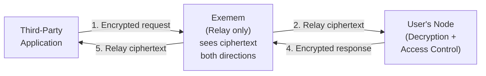

# Data Access Architecture

> **Decision Date**: March 10, 2026
> **Status**: Approved
> **Author**: Tom Tang

## Executive Summary

All user data stored on Exemem's cloud is end-to-end encrypted. Exemem never sees plaintext. Third-party applications access user data by requesting decryption from the user's local node, which remains the sole authority for access control and decryption. There are no fallbacks, no key sharing, and no offline degradation paths.

---

## Core Principles

1. **Exemem is a dumb encrypted store.** It stores ciphertext, relays connections, and enforces mechanical limits (token validity, routing). It never decrypts, never interprets content, and never makes access policy decisions.

2. **The user's node is the sole authority.** All decryption, access control evaluation (trust distance, capabilities, payment gates, security labels), and data filtering happen on the user's node.

3. **No fallbacks.** If the node is offline, requests fail. No degraded mode, no pre-issued decryption keys, no cached plaintext. This constraint is intentional — it forces the always-online problem to be solved properly rather than worked around.

4. **No key sharing.** The user's private key never leaves the node. No derived decryption keys are issued to third parties. The node decrypts on behalf of authorized requesters and returns only the authorized subset of plaintext.

5. **Multi-node.** A user can run many nodes — laptop, phone, home server, managed hosting. Any device with the user's passkey can act as a node. Exemem routes requests to whichever node is online. All nodes sync from the same encrypted store, so they have the same data.

---

## Architecture

### Request Flow

All communication between the app and the user's node is end-to-end encrypted. Exemem relays ciphertext in both directions and never sees plaintext.

1. **App sends request** to Exemem with its JWT (obtained via passkey consent flow). The request payload is encrypted with the node's public key.
2. **Exemem validates the JWT** (authenticity, expiration, quota) and **relays** the encrypted request to the user's node. Exemem cannot read the request body.
3. **Node decrypts the request**, evaluates access control — checks JWT scope, trust distance, capabilities, payment gates, security labels. All four layers must pass.
4. **Node prepares the response** — decrypts the requested data from storage, strips it down to only the authorized fields/folds, then **encrypts the response with the app's public key** and sends it back through Exemem.
5. **Exemem relays** the encrypted response to the app. Exemem cannot read the response body.
6. **App decrypts** the response locally. It receives exactly what it's authorized to see. Nothing more.

Exemem only sees: who is talking to whom, when, and how many bytes. It never sees what.

### What Happens When the Node Is Offline

The request fails. The app receives an error indicating the node is unavailable. There is no degraded path.

---

## Exemem's Role

Exemem is the always-online infrastructure layer. Its responsibilities are strictly mechanical:

| Responsibility | Description |
|:---|:---|
| **Encrypted storage** | Store e2e encrypted blobs. Never decrypt. |
| **Connection relay** | Maintain persistent connections to user nodes. Route third-party requests to the correct node. Relay ciphertext in both directions. |
| **JWT validation** | Verify token authenticity and expiration before relaying. |
| **Access counting** | Track read/write counts per token. Refuse relay once quota is exhausted. |
| **Expiration enforcement** | Refuse relay for expired tokens. |
| **Audit logging** | Log access metadata (who requested, when, quota remaining) for the user's audit trail. |

Exemem does **not**:
- Decrypt any data — not requests, not responses, not stored blobs
- Know what the data contains
- Read request or response bodies (e2e encrypted between app and node)
- Make access policy decisions (those are evaluated by the node in real-time)
- Cache plaintext
- Issue decryption keys

---

## User's Node Role

The node is the product. Everything interesting happens here:

| Responsibility | Description |
|:---|:---|
| **Key management** | Holds the user's private key. Never shares it. |
| **Decryption** | Decrypts data on behalf of authorized requesters. |
| **Access control** | Evaluates all four conjunctive layers: trust distance, cryptographic capabilities, security labels, payment gates. |
| **Field-level filtering** | Returns only the specific fields/folds the requester is authorized to see. |
| **Real-time policy** | Access decisions are evaluated live, not baked into tokens. Revoking access takes effect immediately. |
| **AI ingestion & query** | Schema inference, data ingestion, natural language query — all local. |

---

## Revocation

Because the node evaluates access in real-time on every request, revocation is instant:

- User revokes an app's access in their node settings
- Next request from that app is denied by the node
- No stale decryption keys, no cached grants, no propagation delay

---

## Always-Online Requirement

This architecture requires at least one of the user's nodes to be reachable. Since a user can have many nodes, availability increases naturally — a laptop may sleep, but a phone or home server may still be online. Exemem routes to whichever node is available.

| Option | Description |
|:---|:---|
| **Multi-device** | User runs nodes on multiple personal devices (laptop, phone, tablet, home server). Any device with the user's passkey is a node. More devices = higher availability. |
| **Dedicated hardware** | User runs a dedicated node on always-on hardware (home server, Raspberry Pi, VPS). |

Exemem never runs a node and never has access to user keys. The user is solely responsible for keeping at least one of their nodes online. The more devices running a node, the higher the availability.

---

## Node Bootstrap & Key Management

The user's passkey is the root of trust for the entire system. Node configuration (including the node's private key) is encrypted with a key derived from the passkey and stored on Exemem as an opaque blob.

### First Device Setup

1. User creates an Exemem account with a passkey (WebAuthn).
2. Node generates its Ed25519 keypair locally.
3. Node config (including private key) is encrypted using a key derived from the passkey.
4. Encrypted config blob is uploaded to Exemem. Exemem stores it but cannot read it.

### New Device Setup

1. User authenticates with their passkey on the new device.
2. Exemem serves the encrypted config blob.
3. Device decrypts the blob locally using the passkey-derived key.
4. Node starts with the same identity — same keypair, same data access, same permissions.

The encrypted config blob is just another opaque blob Exemem stores and serves without understanding. Same pattern as all user data.

### Recovery & Loss Scenarios

| Scenario | Outcome |
|:---|:---|
| **Lost a device** | Other devices unaffected. Lost device can no longer decrypt if passkey is removed from it. |
| **Lost all devices, passkey backed up** | Recover on new device via passkey backup (iCloud Keychain, Google Password Manager, hardware key). Download blob, decrypt, back in business. |
| **Lost passkey entirely** | Data is unrecoverable. No backdoor. True sovereignty means true responsibility. |
| **Compromised passkey** | User generates a new passkey, re-encrypts config blob with new passkey-derived key, uploads replacement. Revoke the old passkey. |

---

## Relationship to Third-Party App Authorization

This document extends the [Third-Party App Authorization Design](./THIRD_PARTY_APP_AUTHORIZATION.md). The passkey consent flow and JWT issuance described there remain unchanged. This document specifies what happens *after* the app has a token — how it actually accesses data.

The authorization design describes: how apps get permission.
This document describes: how apps get data.

---

## Alternatives Rejected

### Derived Decryption Keys (Rejected)

User's node generates scoped decryption keys from a master key (HD wallet style) and issues them to apps. Apps decrypt directly from Exemem's encrypted store.

- **Pros**: Node doesn't need to be online after grant. Infinite keys derivable.
- **Cons**: Revocation is hard (can't un-share a key). Access policy baked in at grant time, can't change dynamically. Key management complexity. Fallback mentality.
- **Decision**: Rejected. No key sharing, no fallbacks.

### Server-Side Decryption (Rejected)

Exemem decrypts on behalf of the user using escrowed keys.

- **Pros**: Simple. Always available.
- **Cons**: Exemem sees plaintext. Violates the entire privacy model. Curious server can access user data.
- **Decision**: Rejected. Non-negotiable.

### Selective Encryption (Rejected)

Some data stored in plaintext on Exemem, some encrypted. Apps access the plaintext tier.

- **Pros**: Simple for apps.
- **Cons**: User must decide encryption upfront. Plaintext data is exposed to Exemem. Complexity.
- **Decision**: Rejected. All data is encrypted. No tiers.

---

## References

- [Third-Party App Authorization](./THIRD_PARTY_APP_AUTHORIZATION.md)
- [Multi-tenant Service Design](./MULTI_TENANT_SERVICE_DESIGN.md)
- [Compute Without Exposure (Fold DB Paper)](../fold_db_access_control.tex)
