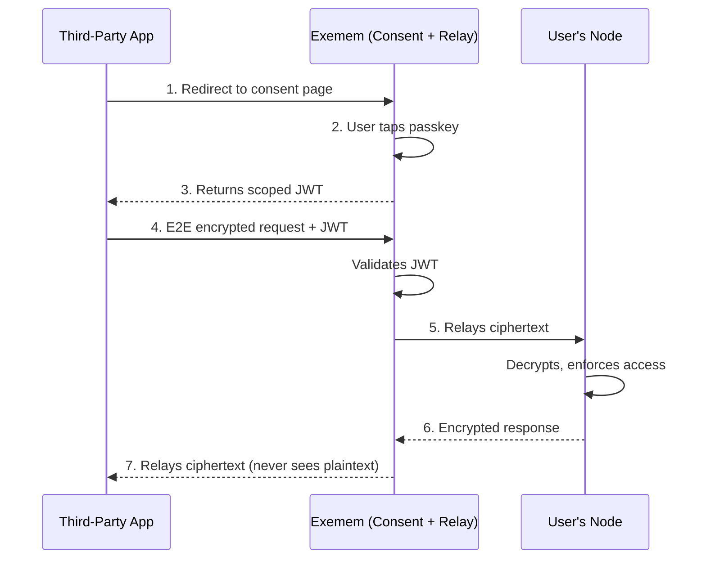

# Third-Party App Authorization Design

> **Decision Date**: February 4, 2026  
> **Status**: Approved  
> **Author**: Tom Tang

## Executive Summary

Exemem aims to become a **unified cloud provider for user data**, enabling users to share the same database across all their applications (e.g., all social media apps querying the same underlying data).

This document captures the architectural decision for how third-party applications will authenticate and access user data.

---

## Decision: Passkey-Native Authorization (Option 1)

**We will implement a passkey-native consent flow** rather than full OAuth 2.0.

### Rationale

1. **Existing Infrastructure**: Exemem already has robust passkey authentication via WebAuthn. Reusing this avoids building a separate OAuth authorization server.

2. **Superior User Experience**: Users authenticate with a single tap of their existing passkey—no new credentials, no password fatigue.

3. **Stronger Security**: Passkeys are phishing-resistant. Apps never see the user's credential, only the scoped token issued by Exemem.

4. **Simpler Implementation**: No refresh tokens, authorization codes, PKCE, or client secrets to manage.

5. **Consistent Identity**: The same `user_hash` derived from the passkey is used everywhere, ensuring unified data access.

---

## Architecture Overview

This document covers how apps **get permission** (the consent flow and token issuance). For how apps **get data** (the decryption and access control flow), see [Data Access Architecture](./DATA_ACCESS_ARCHITECTURE.md).

### Flow Description

1. **App Redirect**: App redirects user to `exemem.com/authorize?app_id=X&scope=read:posts`

2. **Consent Screen**: User sees "App X wants to access your posts" with permission details

3. **Passkey Authentication**: User authenticates with their existing Exemem passkey

4. **Token Issuance**: Exemem issues a scoped JWT containing:
   - `user_hash` (identity)
   - `app_id` (requesting application)
   - `scope` (permitted operations)
   - `exp` (expiration)

5. **API Access**: App sends requests to Exemem with `Authorization: Bearer <jwt>`

6. **Relay**: Exemem validates the JWT and relays the encrypted request to the user's node. All communication between the app and node is e2e encrypted — Exemem sees only ciphertext in both directions.

7. **Node Enforcement**: The user's node decrypts the request, evaluates access control (trust distance, capabilities, payment gates, security labels), filters to authorized fields, encrypts the response with the app's public key, and sends it back through Exemem. The app decrypts locally. See [Data Access Architecture](./DATA_ACCESS_ARCHITECTURE.md) for details.

---

## Components to Build

| Component                 | Priority | Description                                                 |
| :------------------------ | :------- | :---------------------------------------------------------- |
| **App Registry**          | P0       | Table: `{ app_id, name, redirect_uris, owner, created_at }` |
| **Consent Page**          | P0       | UI: Permission display + passkey authentication             |
| **Scoped JWT Issuance**   | P0       | Sign JWT with claims: `user_hash`, `app_id`, `scope`, `exp` |
| **API Middleware**        | P0       | Validate JWT, extract context, enforce scope                |
| **Developer Dashboard**   | P1       | Register apps, view usage, manage API keys                  |
| **Permission Revocation** | P1       | User can revoke app access from Exemem settings             |

---

## Alternatives Considered

### OAuth 2.0 (Rejected)

- **Pros**: Industry standard, well-understood by developers
- **Cons**: Complex to implement (auth server, refresh tokens, PKCE), overkill for our use case
- **Decision**: Rejected in favor of simpler passkey-native flow

### Passkey-Signed Request Tokens (Deferred)

- **Pros**: Cryptographic proof of user intent, no long-lived tokens
- **Cons**: More complex, requires careful nonce management
- **Decision**: Deferred to future iteration if needed

### Direct API Keys Only (Partial Adoption)

- **Pros**: Simple for developers
- **Cons**: No consent flow for end-user permission grants
- **Decision**: Keep for developer/power-user flows, but not for third-party app authorization

---

## Security Considerations

1. **Token Expiration**: JWTs should have short TTL (e.g., 1 hour) with optional refresh mechanism
2. **Scope Validation**: The user's node strictly enforces scope on every request. Exemem validates token authenticity and expiration before relaying.
3. **Redirect URI Validation**: Only allow registered redirect URIs to prevent token theft
4. **Revocation**: Users revoke app access from their node. Takes effect immediately — the node simply stops honoring the token. No propagation delay.
5. **E2E Encryption**: All data on Exemem is encrypted. Exemem never sees plaintext. Decryption happens only on the user's node. See [Data Access Architecture](./DATA_ACCESS_ARCHITECTURE.md).

---

## Future Enhancements

- **Granular Permissions**: Per-schema or per-field access control
- **Usage Quotas**: Rate limiting per app
- **Audit Logging**: Track which apps accessed what data
- **Webhook Subscriptions**: Apps subscribe to data changes with user consent

---

## References

- [Data Access Architecture](./DATA_ACCESS_ARCHITECTURE.md) — How apps get data after authorization
- [Unified Identity System](./identity/unified_identity_system.md) (Knowledge Item)
- [Multi-tenant Isolation](./MULTI_TENANT_SERVICE_DESIGN.md)
- [WebAuthn Specification](https://www.w3.org/TR/webauthn-2/)
